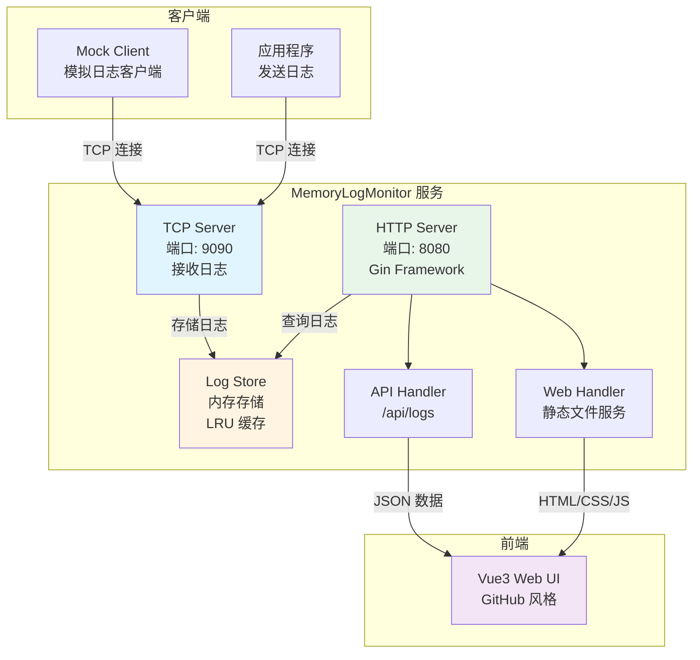

# MemoryLogMonitor

一个轻量级的实时日志监控系统，支持通过 TCP 接收日志，并提供 Web 界面进行查询、筛选和排序。

## English Project Description

### One-Line Summary (for GitHub/Copilot - 298 chars)

**MemoryLogMonitor: Go+Vue3 real-time log monitor. TCP server (port 9090) receives logs, stores in-memory with LRU eviction. HTTP server (port 8080) serves Vue3 web UI. Features: date/keyword filters, sorting, pagination, status API. Thread-safe logstore with sync.RWMutex. Frontend embedded via Go embed. Stack: Gin, Vue3, TypeScript, Vite.**

### Ultra-Short Version (178 chars)

**Go log monitor: TCP(9090) receives logs → in-memory store → HTTP(8080) Vue3 UI. Features: filter, sort, paginate. Thread-safe, LRU cache, embedded frontend. Stack: Gin, Vue3, TS.**

### Full Description

**MemoryLogMonitor** is a lightweight, real-time log monitoring system built with Go and Vue3. It provides a simple yet powerful solution for collecting, storing, and querying application logs through a TCP-based architecture.

**Key Features:**

- **Real-time Log Reception**: Receives log data via TCP protocol on port 9090, supporting multiple concurrent client connections
- **In-Memory Storage**: Uses efficient in-memory caching with configurable size limits and automatic LRU (Least Recently Used) eviction when capacity is exceeded
- **Modern Web Interface**: Features a clean, GitHub-style web UI built with Vue3, TypeScript, and Vite, providing an intuitive user experience
- **Advanced Query Capabilities**: Supports date range filtering, keyword search, Top N queries, and multi-field sorting (by time or content, ascending/descending)
- **Flexible Pagination**: Customizable page sizes (10/20/30/40/50/100/200 records per page) with page navigation and jump-to-page functionality
- **Single-File Deployment**: Frontend resources are embedded into the Go binary, enabling zero-dependency deployment with no separate frontend server required
- **RESTful API**: Provides comprehensive REST API endpoints for log querying, status monitoring, and log management
- **Thread-Safe Operations**: Ensures data consistency with concurrent read/write operations
- **Status Monitoring**: Real-time display of server status including memory usage, log count, and port configuration

**Technology Stack:**

- **Backend**: Go 1.24.12+, Gin Web Framework, Logrus
- **Frontend**: Vue3, TypeScript, Vite, Axios
- **Storage**: In-memory with configurable cache size
- **Protocol**: TCP for log reception, HTTP for web interface

**Use Cases:**

- Development and testing environments for real-time log monitoring
- Application debugging and troubleshooting
- Log aggregation for distributed systems
- Temporary log storage and analysis
- Integration with existing logging frameworks (Log4j2, Logback, etc.)

**Architecture:**

The system consists of three main components:
1. **TCP Server**: Listens on port 9090 for incoming log connections
2. **Log Store**: Thread-safe in-memory storage with LRU cache management
3. **HTTP Server**: Serves the web interface (port 8080) and provides REST API endpoints

**Note**: MemoryLogMonitor stores logs only in memory. Logs will be lost when the program restarts, making it ideal for temporary monitoring and debugging scenarios rather than long-term log archival.


## 项目简介

MemoryLogMonitor 是一个基于 Go 和 Vue3 构建的日志监控工具，具有以下特点：

- **实时日志接收**：通过 TCP 协议接收日志数据
- **内存存储**：使用内存缓存，支持配置缓存大小限制
- **Web 界面**：提供现代化的 GitHub 风格 Web 界面
- **强大的查询功能**：支持日期范围、关键字搜索、排序等功能
- **分页显示**：支持自定义每页显示条数（10/20/30/40/50/100/200）
- **单文件部署**：前端资源嵌入到 Go 二进制文件中，无需单独部署

## 项目架构



### 核心组件

1. **TCP Server** (`tcpserver/`)
   - 监听 TCP 端口接收日志
   - 支持多客户端并发连接
   - 将接收到的日志存储到内存缓存

2. **Log Store** (`logstore/`)
   - 内存日志存储
   - 支持 LRU 缓存策略（超出限制自动删除最旧日志）
   - 线程安全的读写操作
   - 支持按时间、内容排序

3. **HTTP Server** (`cmd/goMonitor/`)
   - 提供 RESTful API 接口
   - 嵌入前端静态资源
   - 支持日志查询、筛选、分页

4. **Web Frontend** (`frontend/`)
   - Vue3 + TypeScript + Vite
   - GitHub 风格 UI
   - 响应式设计

5. **Mock Client** (`cmd/mock-client/`)
   - 测试工具
   - 每 30 秒发送 50 条日志
   - 支持优雅退出

## 功能特性

### 日志查询
- ✅ 日期范围筛选（开始日期、结束日期）
- ✅ 关键字搜索（日志内容）
- ✅ Top N 最新日志查询
- ✅ 按时间排序（升序/降序）
- ✅ 按内容排序（升序/降序）
- ✅ 分页显示（支持 10/20/30/40/50/100/200 条/页）

### 界面功能
- ✅ 实时刷新
- ✅ 一键重置所有筛选条件
- ✅ 表格每 5 行高亮显示
- ✅ 序号列显示
- ✅ 缓存统计信息显示

## 编译环境要求

### 后端（Go）
- **Go 版本**：1.24.12 或更高
- **操作系统**：Linux、macOS、Windows
- **依赖管理**：Go Modules

### 前端（Node.js）
- **Node.js 版本**：16.x 或更高
- **包管理器**：npm 或 yarn
- **构建工具**：Vite 4.5.0

## 如何编译

### 方式一：使用 Makefile（推荐）

```bash
# 编译所有组件（前端 + 后端 + mock-client）
make build

# 仅编译后端
make backend

# 仅编译前端
make frontend

# 仅编译 mock-client
make mock-client

# 清理构建产物
make clean
```

### 方式二：手动编译

#### 1. 编译前端

```bash
cd frontend
npm install  # 首次运行需要安装依赖
npm run build
cd ..
```

#### 2. 复制前端资源

```bash
rm -rf web/dist
mkdir -p web
cp -r frontend/dist web/dist
```

#### 3. 编译后端

```bash
go build -o bin/memory-log-monitor ./cmd/goMonitor
```

#### 4. 编译 mock-client

```bash
go build -o bin/mock-client ./cmd/mock-client
```

## 如何使用

### 1. 配置文件

编辑 `cmd/goMonitor/config.yml`：

```yaml
http_port: 8080      # HTTP 服务端口
tcp_port: 9090      # TCP 日志接收端口
cache_size_mb: 100   # 内存缓存大小（MB）
```

### 2. 启动服务

```bash
# 使用 Makefile
make run

# 或直接运行
./bin/memory-log-monitor -config cmd/goMonitor/config.yml

# 或使用 go run
go run ./cmd/goMonitor -config cmd/goMonitor/config.yml
```

服务启动后：
- HTTP 服务：http://localhost:8080
- TCP 日志接收：localhost:9090

### 3. 发送日志

#### 方式一：使用 mock-client（测试）

```bash
# 启动 mock-client（每 30 秒发送 50 条日志）
./bin/mock-client -addr 127.0.0.1:9090

# 或使用 go run
go run ./cmd/mock-client -addr 127.0.0.1:9090
```

#### 方式二：应用程序直接发送

通过 TCP 连接发送日志，每行一条日志：

```bash
# 使用 nc (netcat)
echo "这是一条测试日志" | nc localhost 9090

# 或使用 telnet
telnet localhost 9090
```

#### 方式三：程序集成

在你的应用程序中，通过 TCP 连接发送日志：

```go
conn, err := net.Dial("tcp", "localhost:9090")
if err != nil {
    log.Fatal(err)
}
defer conn.Close()

fmt.Fprintf(conn, "[%s] INFO: 这是一条日志\n", time.Now().Format(time.RFC3339))
```

### 4. 访问 Web 界面

打开浏览器访问：http://localhost:8080

## 项目结构

```
goMonitor/
├── cmd/
│   ├── goMonitor/          # 主服务程序
│   │   ├── main.go        # 服务入口
│   │   └── config.yml     # 配置文件
│   └── mock-client/       # 模拟客户端
│       └── main.go
├── config/                # 配置管理
│   └── config.go
├── logstore/              # 日志存储
│   └── logstore.go
├── tcpserver/             # TCP 服务器
│   └── tcpserver.go
├── web/                   # Web 资源
│   ├── embed.go          # 前端资源嵌入
│   └── dist/             # 前端构建产物（自动生成）
├── frontend/              # 前端源码
│   ├── src/
│   │   ├── App.vue       # 主组件
│   │   ├── main.ts       # 入口文件
│   │   └── style.css     # 样式文件
│   ├── package.json
│   └── vite.config.ts
├── bin/                   # 编译产物目录
├── Makefile              # 构建脚本
├── go.mod                # Go 模块定义
└── README.md             # 本文档
```

## API 接口

### GET /api/logs

查询日志接口

**查询参数：**
- `page` (int): 页码，从 1 开始，默认 1
- `pageSize` (int): 每页条数，默认 20，最大 1000
- `startDate` (string): 开始日期，格式：YYYY-MM-DD
- `endDate` (string): 结束日期，格式：YYYY-MM-DD
- `q` (string): 关键字搜索（日志内容）
- `topN` (int): Top N 最新日志，0 表示关闭
- `sortBy` (string): 排序字段，可选值：`time`、`content`
- `sortOrder` (string): 排序顺序，可选值：`asc`、`desc`

**响应示例：**

```json
{
  "items": [
    {
      "time": "2026-01-28T10:30:00Z",
      "content": "[2026-01-28T10:30:00Z] INFO: 这是一条日志"
    }
  ],
  "total": 100,
  "page": 1,
  "pageSize": 20,
  "cacheCount": 150,
  "cacheSizeBytes": 1048576
}
```

## 开发说明

### 前端开发

```bash
cd frontend
npm install
npm run dev  # 开发模式，支持热重载
```

### 后端开发

```bash
# 运行服务
go run ./cmd/goMonitor -config cmd/goMonitor/config.yml

# 运行 mock-client
go run ./cmd/mock-client -addr 127.0.0.1:9090
```

### 重新构建前端

修改前端代码后，需要重新构建并复制到 `web/dist`：

```bash
make frontend
```

## 注意事项

1. **内存限制**：日志存储在内存中，超出配置的缓存大小会自动删除最旧的日志
2. **数据持久化**：当前版本不支持数据持久化，服务重启后数据会丢失
3. **并发安全**：Log Store 使用读写锁保证线程安全
4. **端口占用**：确保 TCP 端口（默认 9090）和 HTTP 端口（默认 8080）未被占用

## 许可证

本项目采用 MIT 许可证。

## 贡献

欢迎提交 Issue 和 Pull Request！
